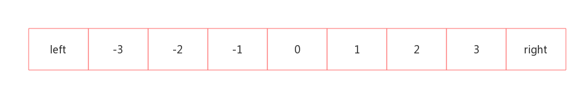

# 协议实现

## 概述

- 由于TiKV(RocksDB)存储的是key-value型结构的数据, 所以TiTea做的很重要的事情就是如何将Redis丰富的数据结构转化为KV型结构

- 以下各种实现, 假定命名空间是default.default, 系统前缀是kv, 则每个key的header为`kvdefault.default`. 不了解命名空间? [请戳](./namespace.md)

### Meta元信息说明

- 每个key都有元信息Meta
- Meta包含的信息有: 
    - Type, redis数据类型,定长, 1个字节, String(r)/Hash(h)/List(l)/Set(s)/ZSet(z) 
    - ID, 每个redis对象, 会生成一个ID, 定长, 16字节
    - Count, 元素数量, 定长, 8字节, 非String类型需要, 如Hash, 记录的是Hash key里所有字段的数量
    - CreateAt, 创建时间, 定长, 8字节
    - ExpireAt, 过期时间, 定长,8字节, 如果没有设置过期, 则为0
    - Extra, 特殊字段,非定长, 针对某些类型数据有意义,某些类型数据没有意义,具体参加如下各结构实现
- Meta也是以key-value形式存储, meta key为: `header|m|key`, 元信息的类型用m来表示
- Meta的value为各元信息各字段的拼接,格式为: `type(1)|ID(16)|count(8)|createAt(8)|expireAt(8)|extra`
- 每个非String类型的数据, 底层存储时, 都是以 `header|d|ID`开始的,`d`表示类型,一个字节; 以下出现`header|d|ID`不再做额外解释

## String
- 简单KV结构, value保存在Meta的extra字段里, 除了metaKey外不会再创建其它key; 当执行read操作,则只需通过元信息,就可以获取到value
- 没有其它的key存储, 减少额外开销

## Hash
- hash里每增加一个field, meta里的Count加1; 反之, 减1; 当Count=0时, Meta删除
- hash里的每个field, 对应存储层的一个key, key为: `header|d|ID|field`, value为field的value
- 例子: 执行hmset h1 f1 v1 f2 v2, 则对应存储3个key:
   - meta key: 见元信息说明部分, Count=2
   - field f1: key: `header|d|ID|f1`; value: v1
   - field f2: key: `header|d|ID|f2`; value: v2
- 执行hash的read或者write类操作时, 通过元信息获取到ID, 再通过ID拼接出field的key进行读写操作

## List
- list里每增加一个element, meta的Count加1; 反之, 减1; 当Count=0时, Meta删除
- list列表顺序的维持,是通过left和right 2个整数索引位置来维持的, 如下图, left与right的数据保存在Meta的extra里

  
- left 与 right 通过伸缩(++ or --)的方式, 完成push与pop的操作
- list里的每个element, 对应存储层的一个key, key为: `header|d|ID|pos or neg(1)|index(8)`, value为element
> 索引为int64型整数, 转化为二进制字节后, 负数的字节序要大于正数的字节序(0正1负), 不满足序关系, 因此需要增加
> 一个字节来区分正负数, 增加的字节需要满足正数的字节序大于负数的字节序, 例如正数索引前增加`>`(ascii 76), 负索索引前增加`<`(ascii 74)
- 由于list的索引是顺序的,所以目前不支持在任意位置的插入删除操作
- 当执行read或者write操作时, 通过元信息获取去ID和left/right索引位置, 然后拼接出元素的key进行读写操作

## Set
- set在存储上与hash很相似
- set里每增加一个member, meta的Count加1; 反之, 减1; 当Count=0时, Meta删除
- set里的每个member, 对应存储层的一个key, key为: `header|d|ID|member`, value为member
- 例子: 执行sadd s1 m1 m2, 则会存储3个key:
    - meta key: `header|m|m1`, value: Count=2
    - m1 key: `header|d|ID|m1`, value: m1
    - m2 key: `header|d|ID|m2`, value: m2
- 当执行set的read或者write操作时, 通过元信息获取到ID, 再通过ID拼接出member的key进行读写操作

## ZSet
- sorted set与hash结构有些类似, 都是KV型数据, 但是value必须是数值型; score支持float64
- range/rank等操作都是按照score的大小排序, 因此需要考虑将score部分转化为字节后作为key的一部分
- zset里每增加一个member,则对应meta里的Count加1; 反之, 减1; 当Count=0时, Meta删除
- zset里的每个元素, 会存储2个key, member一个, score一个:
    - member: key: `header|d|ID|withoutScore(1)|member` value: []byte(score)
    - score: key: `header|d|ID|withScore(1)|score(8)|member` value: []byte(score)
> member key有一个字节的withoutScore, score key有一个字节的withScore, 主要为了通过前缀的方式区别出来是memberKey还是scoreKey,
> 这样在通过scoreKey获取排序数据时, 通过 `header|d|ID|withScore(1)`的形式可以获取全部包含score key的数据;
- 由于浮点数表示方式的问题,负浮点数转化为字节序列后不再满足序关系,可是score的排序必须满足序关系,既如果a<b,则字节序byte(a)<byte(b);
  幸得文章[浮点数字节序比较](https://www.jianshu.com/p/edb0a016e477)

