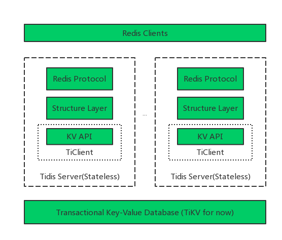
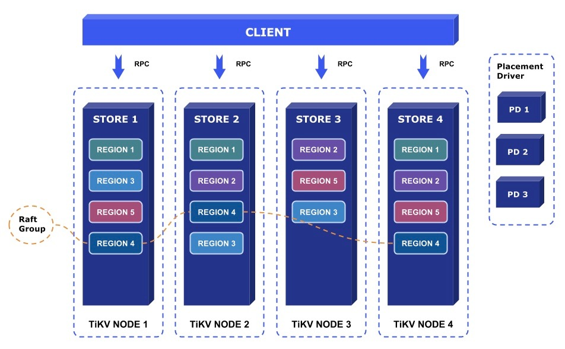

## kv的结构

## tikv的结构

+ Placement Driver (PD): PD is the brain of the TiKV system which manages the metadata about Nodes, Stores, Regions mapping, and makes decisions for data placement and load balancing. PD periodically checks replication constraints to balance load and data automatically.
+ Node: A physical node in the cluster. Within each node, there are one or more Stores. Within each Store, there are many Regions.
+ Store: There is a RocksDB within each Store and it stores data in local disks.
+ Region: Region is the basic unit of Key-Value data movement and corresponds to a data range in a Store. Each Region is replicated to multiple Nodes. These multiple replicas form a Raft group. A replica of a Region is called a Peer.
